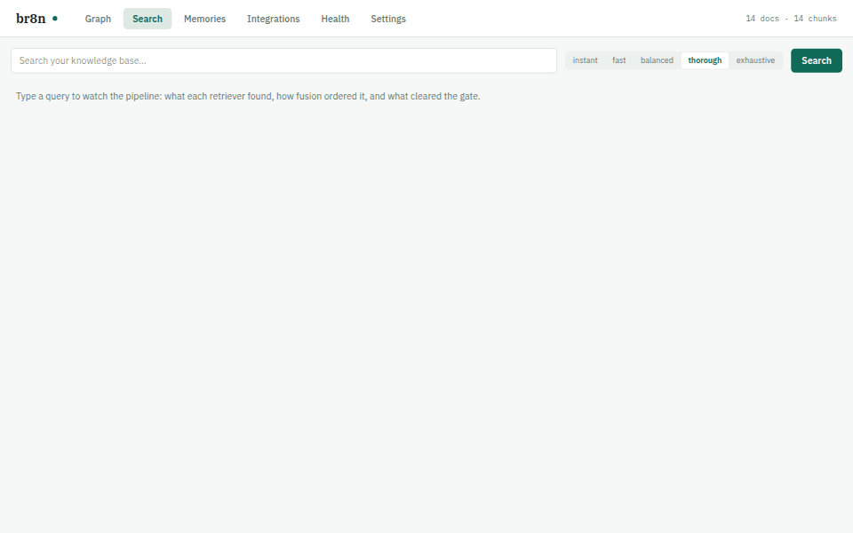

# br8n

Local, semantic search over your own knowledge base (notes, papers, web
clippings and past agent sessions), injected into your coding agent's prompts
automatically.

br8n indexes the folders you point it at, embeds them with a small model
running on your own machine through [Ollama](https://ollama.com), and serves
the results two ways:

- **Automatic context.** A prompt hook adds the most relevant passages to
  every prompt, but only when they clear a confidence gate.
- **On-demand search.** An MCP tool lets the agent search your knowledge base
  whenever it decides to.

It works with Claude Code, Codex, Gemini CLI, Cursor and Claude Desktop. It
also keeps durable memories (lessons and facts that carry across sessions) and
has a local web dashboard for searching, exploring and configuring everything.



Nothing leaves your machine: no cloud embedding API and no telemetry. br8n
itself goes online only to check daily for a newer release, to fetch the OCR
model the first time it reads a scanned PDF, to fetch pages you add with
`br8n add <url>`, and, if you turn it on, to back up to your own S3 bucket or
Google Drive. The dashboard also loads its web fonts from Google Fonts.

## Why br8n?

- **Context arrives on its own.** Most memory and search tools for agents
  are an MCP tool the agent has to remember to call. br8n also injects
  context into every prompt automatically, but only what clears a calibrated
  confidence gate, so the agent isn't flooded with noise.
- **It remembers your past sessions.** Your Claude Code and Codex
  transcripts are indexed too, so "how did we fix this last time?" has an
  answer.
- **Retrieval you can inspect.** Vector, keyword and link-graph results are
  fused, superseded decision records are demoted, and the dashboard shows
  exactly what each stage found and what reached the prompt.
- **Local and simple.** One Rust binary, embeddings through Ollama on your
  machine, no cloud API, no telemetry and no server to run.
- **One index for every agent.** Claude Code, Codex, Gemini CLI, Cursor and
  Claude Desktop all use the same knowledge base.

## Install

You need a Mac with Apple silicon or Linux on x86_64 (Ubuntu 24.04 or newer),
plus [Ollama](https://ollama.com) running. On Windows, use the Linux build
inside WSL.

```bash
curl -fsSL https://github.com/Jagma/br8n/releases/latest/download/install.sh | sh
```

The installer puts `br8n` on your PATH, downloads the embedding model (about
600 MB, after asking), registers the Claude Code plugin, and offers to connect
the other agents it finds. Other ways to install, including building from
source, are in the [install guide](docs/install.md).

## Get started

1. **Choose what to search.** Run `br8n dashboard` and follow the three-step
   setup, or do it from the terminal:

   ```bash
   br8n config set sources '["~/notes", "~/Documents/papers"]'
   br8n index
   ```

2. **Restart your agents** so they load br8n.
3. **Check it works:**

   ```bash
   br8n status                        # every check should pass
   br8n search "something in your notes"
   ```

Then ask your agent about something from your notes. After the first index,
br8n re-reads only what changed, and each new Claude Code session refreshes
the index in the background.

## Everyday commands

```bash
br8n dashboard            # search, graph, memories, health and settings in the browser
br8n search "query"       # search from the terminal
br8n index                # pick up new or changed files
br8n status               # index size, settings and any problems
br8n connect codex        # connect another agent (see: br8n agents)
br8n update               # install the newest release
br8n uninstall            # remove br8n; add --purge to delete its config and index too
```

## Roadmap

- **Native Windows support** is the headline for 0.2. Until then, use the
  Linux build inside WSL.
- **More release builds:** Linux on arm64 (Intel Macs are blocked on an
  upstream library issue and need to build from source).
- **Dashboard fonts bundled** instead of loaded from Google Fonts.

Ideas and bug reports are welcome in the
[issues](https://github.com/Jagma/br8n/issues); see
[CONTRIBUTING.md](CONTRIBUTING.md) to get started on the code.

## Documentation

- [Install guide](docs/install.md): every install option, building from
  source, updating, uninstalling and install problems
- [Using br8n](docs/usage.md): indexing, memory, the dashboard, connecting
  agents and slash commands
- [Configuration and tuning](docs/configuration.md): the config file, quality
  tiers, ranking, remote embedding endpoints and scanned PDFs
- [Backups](docs/backups.md): encrypted backups to S3 or Google Drive
- [Troubleshooting](docs/troubleshooting.md)
- [Cutting a release](docs/releasing.md), for maintainers

## License

br8n is licensed under the [GNU Affero General Public License v3.0](LICENSE)
(AGPL-3.0-only). You can use, modify and share it freely; if you distribute a
modified version, or run one as a service that others use over a network, you
must make your source code available under the same licence.

Copyright (C) 2026 Jagma
