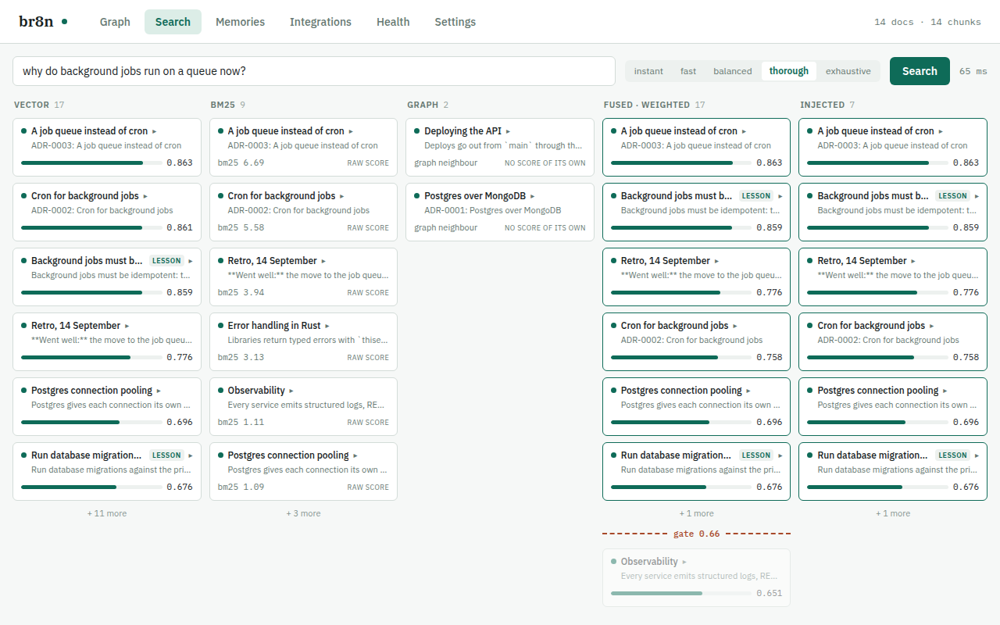
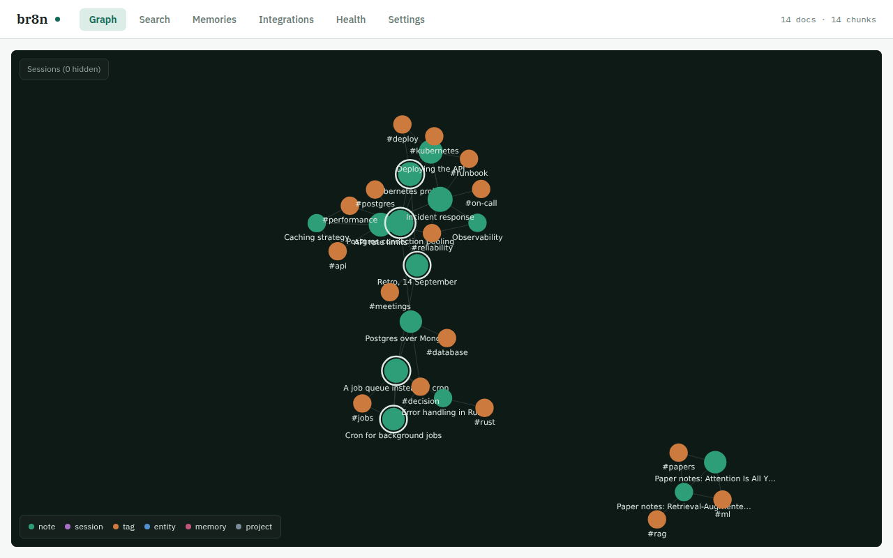

# Using br8n

## Index and search

```
br8n index              # index everything configured
br8n index --reindex    # drop and rebuild from scratch
br8n search "your query"
br8n status             # counts, settings, skipped files, live index progress
br8n audit-injections   # what the hook actually put in your prompts, from its own ledger
```

Re-indexing is incremental, like `git status`: files are stat-fingerprinted
before they are read, and unchanged chunks reuse their stored embeddings. A
run where nothing changed costs zero seconds; an appended transcript pays only
for the appended text. `br8n status` shows a live progress line (percent,
chunks, ETA) for any index in progress, including one started by a session
hook you never saw.

Prompts take priority over indexing: a query holds a marker that indexing
workers yield to between batches, so the hook keeps injecting even while a
long re-index runs.

Or, from inside Claude Code, use the slash commands below. Once indexed, the
prompt hook runs automatically on every turn.

## Memory

Alongside retrieval over your files, `br8n` keeps durable memories: things
worth remembering across sessions that were never written down as a note.
There are three kinds — a **lesson** is a correction or rule you taught
Claude, a **fact** is something durable about you or your setup, and an
**episode** is what happened in a session and what was decided, distilled
automatically from finished Claude Code and Codex transcripts. Memories live in their own database
beside the index and are searchable the moment they are saved — no
`br8n index` run required.

```
br8n memory add --kind lesson "Never comment code unless asked"
br8n memory add --kind fact --global "The notes vault lives at ~/notes/vault"
br8n memory list [--kind lesson|fact|episode] [--project <dir>] [--json]
br8n memory forget <id>
br8n memory distill [--all] [--session <path>]
br8n memory rebuild
br8n memory export [--out <file>]
br8n memory import <file>
```

By default a memory is scoped to the current project directory — only
sessions started there see it in `<br8n-lessons>` — pass `--global` to apply
it everywhere, or `--project <dir>` to name a directory explicitly. `rebuild`
re-embeds every memory with the currently configured model and republishes;
`export`/`import` move memories as JSON lines, for backup or for carrying them
to another machine.

From inside Claude Code, two MCP tools drive the same store: `br8n_remember`
saves a lesson, fact or episode and returns its id, and `br8n_forget` deletes
one by id when you say it no longer applies. `/br8n-remember <rule>` and
`/br8n-memories [kind]` are the matching slash commands.

Every lesson that applies to the current project is shown at the start of a
session, inside a `<br8n-lessons>` block printed as plain text (not JSON) so
other session-start output can precede it on stdout:

```
<br8n-lessons>
Corrections this user has taught Claude. Follow them; they override defaults.
If the user says one no longer applies, call br8n_forget with its id.
- [a1b2c3 · 2026-09-01 · global] Never comment code unless asked
</br8n-lessons>
```

Beyond that, every memory — lesson, fact or episode — is also retrieved by
relevance on ordinary prompts and MCP searches, alongside your notes, ranked
and gated by the same `relevance` score. Episodes decay: an old one still
matches, but with less weight than a recent one, controlled by
`episode_half_life_days` and `episode_decay_floor` below.

```toml
[memory]
enabled = true                    # false disables saving AND injection
lessons_max_tokens = 600          # budget for the <br8n-lessons> block
min_confidence = 80               # floor for memories Claude writes on its own
duplicate_similarity = 0.94       # near-duplicate text replaces, not doubles
episode_half_life_days = 30.0     # an episode's relevance decays over time
episode_decay_floor = 0.85        # decay never drops an episode below this
distill_episodes = true           # automatically summarize finished sessions
distill_after_hours = 3.0         # a transcript must be idle this long first
distill_idle_secs = 60            # skip distillation while a prompt is live
distill_model = "qwen3:4b"        # the Ollama model that writes episodes
max_memories = 10000              # oldest episodes are pruned past this cap
```

### Exploring memories

`br8n dashboard` has a Memories tab that lists every memory with its kind,
date and scope, filters them, and creates, edits and deletes them. On the
graph, memories are drawn in their own colours, one per kind, joined to the
session they were distilled from and the project they are scoped to. Saving a
memory embeds it, so Ollama must be running to create one or change its text or
kind. A lesson's or fact's
id comes from its kind and text, so editing either gives it a new id.

## Dashboard





`br8n dashboard` opens a local web dashboard (127.0.0.1 only): the knowledge
graph with your notes, links, tags and entities; a search view that shows the
whole pipeline — what vector, keyword and graph retrieval each found, how
fusion ordered it, and exactly what cleared the injection gate; and a health
view with index counts, skipped files, live re-index progress, and the last
`br8n bench` results, and the installed version with an Update button when a
newer release exists. `--port N` pins the port, `--no-open` skips the
browser. The dashboard opens the store per request, so it never blocks the
prompt hook.

The Settings tab edits `config.toml` without a terminal: sources (with a
Re-index now button and live progress), retrieval tier, threshold and token
budget for the hook and for MCP, the embedding backend (local Ollama or a
remote endpoint with a write-only token, and a Test connection button),
memory, PDF/OCR, updates and backup, ranking weights, and a raw TOML view.
Every field shows its default and can be reset to it; values are checked as
you type, a save shows the diff first, and a file edited by hand while the
page was open is never overwritten. Comments in the file survive a save, and
the hook picks the change up on its next prompt. Changing the embedding model
or dimensions offers a full re-index.

The Integrations tab has a card for each coding agent br8n found on this
machine: its version, whether br8n is connected (or needs repair, and why),
what the connection gives it (MCP tools, context on every prompt, session
start, indexed sessions), and the config file it lives in. Connect,
Disconnect and Repair run the same code as `br8n connect`, and the card then
lists the files it wrote, the `.br8n-bak` copies it kept and anything left
for you to do, such as trusting Codex's hook once or restarting Claude
Desktop. A config file br8n cannot parse is refused and left as it was. The
Codex card has an opt-in checkbox for the `AGENTS.md` guidance block. Agents
that are not installed are listed under "Not installed", and a last card has
the JSON and TOML snippets for any other MCP client.

Health has an Install card with the same checks as `br8n status`: the
installed binary, the plugin files, the Claude Code marketplace and
registration, and `br8n` on PATH. Each failed check shows its fix, a Connect
Claude Code button where that repairs it and the exact command otherwise. It
also tests the embedding endpoint and lists any problem in `config.toml`,
each with a button that opens the Settings field it names.

On a machine with nothing indexed and no `sources`, the dashboard opens a
three-step setup instead of the graph: pick folders (checked as you type and
saved to `config.toml`), connect the agents it found, then index with live
progress, which ends on Search with a first query taken from your own notes.
"Skip setup" goes back to the normal tabs and is remembered in this browser;
the graph's empty state can open the setup again.

## Connect other agents

`br8n install` connects Claude Code, as it always has, then looks for the
other coding agents it knows and asks before connecting each one it finds
(`--yes` connects them all without asking). The same thing, one agent at a
time:

```bash
br8n agents                      # which agents are installed, connected, and what each gets
br8n connect codex cursor        # write br8n into their configs
br8n connect codex --instructions  # also add a marked block to Codex's global AGENTS.md
br8n connect --all-detected
br8n disconnect gemini
br8n connect --print mcp-json    # print a config snippet for any other MCP client
```

| Agent | What `br8n connect` writes | What the agent gets |
|-------|-----------------------------|---------------------|
| `claude-code` | the plugin, through `claude plugin` | MCP tools, the prompt and session hooks, commands, skills |
| `codex` | `[mcp_servers.br8n]` in `$CODEX_HOME/config.toml` (default `~/.codex`), a `UserPromptSubmit` hook in `hooks.json` beside it, and with `--instructions` a block in `AGENTS.md` | MCP tools, context injected into each prompt, its sessions indexed |
| `gemini` | `mcpServers.br8n` and a `BeforeAgent` hook in `~/.gemini/settings.json` | MCP tools, context injected into each prompt |
| `cursor` | `mcpServers.br8n` in `~/.cursor/mcp.json` | MCP tools |
| `claude-desktop` | `mcpServers.br8n` in `claude_desktop_config.json` (`~/Library/Application Support/Claude/` on macOS, `~/.config/Claude/` on Linux) | MCP tools |

Every entry runs the installed binary by its absolute path
(`<data>/br8n/bin/br8n mcp`), so run `br8n install` first. Connecting
touches only br8n's own entries: every other key, server and hook in the file
is kept, the first time br8n rewrites a file it keeps the original beside it
as `<file>.br8n-bak`, connecting twice changes nothing, and a file that does
not parse (a JSON file with comments, say) is refused with an error that names
it rather than rewritten. `br8n disconnect` removes only what br8n added;
`br8n uninstall` disconnects every agent. Codex asks you to trust a new hook
once (`/hooks`); Claude Desktop needs a restart to load the server. The
dashboard's Integrations tab (through `/api/agents`) drives the same code.

## Slash commands

| Command | What it does |
|---|---|
| `/br8n-index` | Index or re-index your knowledge base; reports documents added/updated/skipped and chunk/edge counts. |
| `/br8n-search <query>` | Search and show matching excerpts grouped by source document. |
| `/br8n-status` | Show index size, embedding model, and per-surface quality settings; flags anything that looks wrong. |
| `/br8n-bench` | Measure recall@5 and latency at every quality tier; recommends tiers for the hook and the MCP tool. |
| `/br8n-golden` | Write the golden set `/br8n-bench` measures against, seeded from your own index, and check it for the faults that make a measurement meaningless. |
| `/br8n-add <url or path>` | Add a single URL or file to the index. |
| `/br8n-remember <rule>` | Save a lesson for future sessions. |
| `/br8n-memories [kind]` | List what br8n remembers, grouped by kind. |
